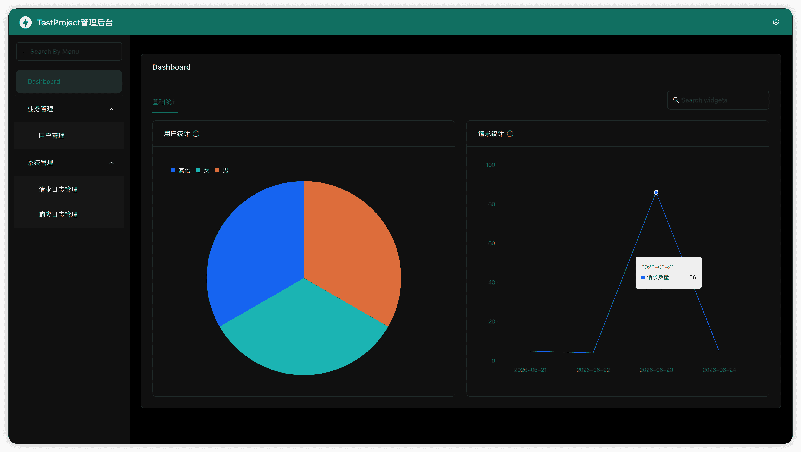
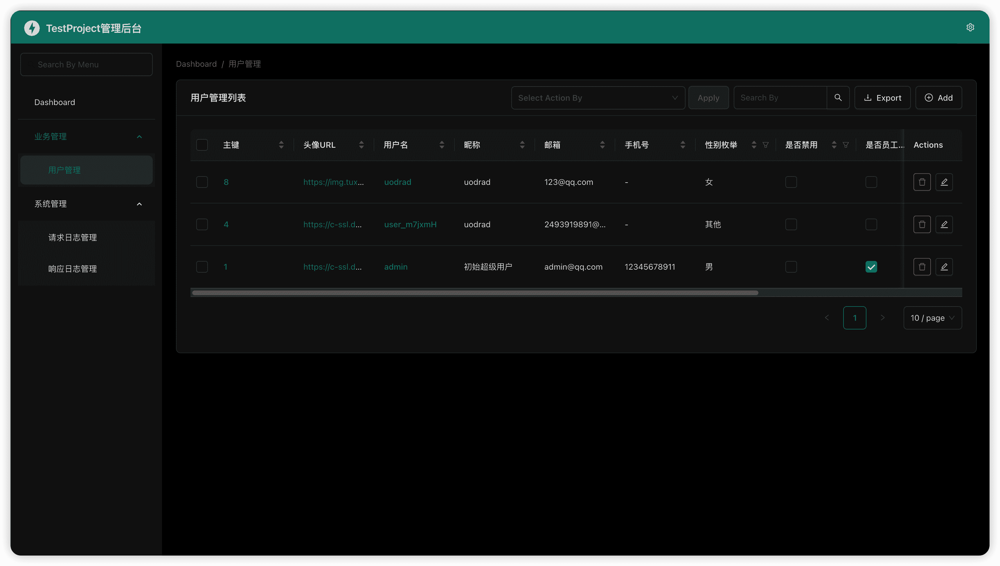
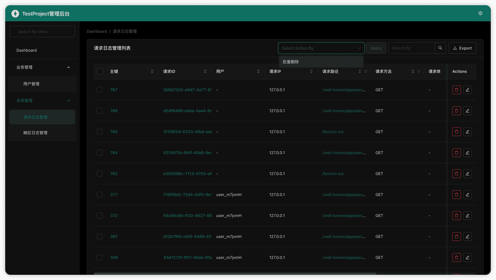

# FastAPI 后端开发模板

一个面向业务开发的 FastAPI 后端模板项目。项目灵感来源于 **Django 的 Admin/Model 思路** 和 **Java SpringBoot 的分层组织方式**，目标是在 FastAPI 生态下提供一套清晰、可扩展、开箱即用的后端基础架构。

模板内置用户模块、认证鉴权、统一响应、异常处理、请求日志、后台管理、配置管理、MySQL、Redis、邮件、WebSocket、生产启动脚本等常用能力，适合作为中小型业务系统、管理后台、API 服务的基础工程。

> 配套Apifox接口文档：https://s.apifox.cn/f831c5ef-d359-4641-a8b8-56248768ffe9

## 项目预览

### 后台首页



### 用户管理



### 请求日志管理



## 核心特性

- **分层架构**：按 `Controller`、`Logic`、`Model` 拆分业务，接近 SpringBoot 常见的控制器、服务、模型分层。
- **模块化服务目录**：每个业务模块独立放在 `application/service/<module>/` 下，便于扩展和维护。
- **自动注册机制**：路由、异常、中间件、后台管理按目录约定自动加载，减少重复配置。
- **后台管理**：基于 `fastadmin` 集成后台管理能力，并封装 `BaseAdmin`，支持读取 ORM 字段 `description` 作为后台列名。
- **认证鉴权**：基于 JWT、Redis、依赖注入实现登录态校验和当前用户获取。
- **统一响应和状态码**：通过 `ResponseUtil` 和 `StatusCodeEnum` 规范接口返回结构。
- **统一异常处理**：自定义 `BasicException` 和全局异常处理器，集中处理业务异常和系统异常。
- **请求日志**：中间件采集请求信息并异步写入系统日志表，后台可查看请求记录和统计图表。
- **异步 ORM**：使用 `tortoise-orm` 连接 MySQL，支持模型化开发和可选自动建表。
- **Redis 工具封装**：封装缓存、验证码、Token、WebSocket 消息等常见操作。
- **生产脚本**：内置 `service.sh`，支持启动、停止、重启、强杀和查看状态。

## 技术栈

| 类型 | 技术 |
| --- | --- |
| Web 框架 | FastAPI |
| ASGI 服务 | Uvicorn / uvloop |
| ORM | tortoise-orm |
| 数据库 | MySQL + asyncmy |
| 缓存 | Redis |
| 认证 | pyjwt |
| 后台管理 | fastadmin |
| 配置 | pyyaml |
| 日志 | loguru |
| 邮件 | zmail |
| 序列化 | orjson |
| WebSocket | Starlette WebSocket |

完整依赖见 [requirements.txt](./requirements.txt)。

## 环境要求

- Python `>= 3.12`
- MySQL
- Redis
- 推荐使用 `venv` 或 `conda`、`uv` 隔离环境

## 快速开始

### 1. 创建虚拟环境

```bash
python -m venv venv
source venv/bin/activate
# Windows 可使用：
# venv\Scripts\activate
```

### 2. 安装依赖

```bash
pip install -r requirements.txt
```

### 3. 创建配置文件

```bash
cp config-template.yaml config.yaml
```

然后按实际环境修改 `config.yaml`：

```yaml
ProjectName: 'YouProjectName'

ServerConfig:
  host: '0.0.0.0'
  port: 7878
  workers: 1
  log_dir: 'logs'
  token_expire: 604800
  secret_key: "your-secret-key"
  captcha_expire: 300

DatabaseConfig:
  MysqlConfig:
    host: '127.0.0.1'
    port: 3306
    database_name: 'test_project'
    username: 'root'
    password: 'root'
    auto_create_table: false

  RedisConfig:
    host: '127.0.0.1'
    port: 6379
    password: ''
    db: 6
```

`config.yaml` 应作为本地私有配置文件使用，不建议提交到版本库。

### 4. 启动项目

开发模式：

```bash
python main.py dev
```

生产模式：

```bash
python main.py pro
```

访问地址：

```text
http://127.0.0.1:7878
```

后台管理：

```text
http://127.0.0.1:7878/admin
```

默认超级管理员：

```text
用户名：admin
密码：admin
```

首次启动且用户表为空时，系统会自动创建初始管理员用户。

## 生产启动脚本

项目提供 [service.sh](./service.sh) 用于生产环境进程管理：

```bash
./service.sh start     # 启动
./service.sh stop      # 优雅停止
./service.sh kill      # 强制结束
./service.sh restart   # 重启
./service.sh status    # 查看状态
```

脚本默认执行：

```bash
venv/bin/python main.py pro
```

可通过环境变量覆盖默认配置：

```bash
PYTHON_BIN=/usr/local/bin/python3 LOG_DIR=/var/log/fastapi ./service.sh start
```

生产部署建议配合 Nginx、Caddy 或其他网关使用，负责 HTTPS、反向代理、静态资源缓存和访问控制。

## 项目结构

```text
fastapi-template/
├── application/
│   ├── __init__.py                 # FastAPI 应用创建、ORM/路由/中间件/异常/后台注册
│   ├── config/                     # 配置读取与配置对象
│   │   ├── DatabaseConfig.py       # MySQL / Redis 配置
│   │   ├── EmailConfig.py          # 邮件配置
│   │   ├── ServerConfig.py         # 服务、CORS、Token 等配置
│   │   └── __init__.py             # 读取 config.yaml
│   ├── dependency/                 # 依赖注入
│   │   └── AuthDependency.py       # Token 解析、登录校验、当前用户
│   ├── exception/                  # 异常体系
│   │   ├── BasicException.py       # 业务异常
│   │   └── __init__.py             # 全局异常处理
│   ├── initial/                    # 基础类
│   │   ├── BaseAdmin.py            # 后台管理基类
│   │   ├── BaseController.py       # 根路由和 WebSocket 基础入口
│   │   ├── BaseEntity.py           # 通用实体
│   │   ├── BaseEnum.py             # 状态码等枚举
│   │   └── BaseModel.py            # ORM 模型基类
│   ├── middleware/                 # 中间件
│   │   ├── PermissionMiddleware.py # 用户权限处理
│   │   └── ProcessMiddleware.py    # 请求处理和请求日志采集
│   ├── service/                    # 业务模块
│   │   ├── common/                 # 通用服务，如验证码
│   │   ├── system/                 # 系统模块，如请求日志/响应日志后台管理
│   │   └── user/                   # 用户模块，含用户接口、模型、后台管理
│   ├── util/                       # 工具包
│   │   ├── CommonUtil.py
│   │   ├── EmailUtil.py
│   │   ├── FileUtil.py
│   │   ├── LogUtil.py
│   │   ├── MysqlUtil.py
│   │   ├── RedisUtil.py
│   │   ├── ResponseUtil.py
│   │   ├── StringUtil.py
│   │   ├── TimeUtil.py
│   │   ├── TokenUtil.py
│   │   └── WebSocketUtil.py
│   └── dispatch.py                 # 异步后台任务和请求日志写入
├── docs/                           # 项目截图
├── config-template.yaml            # 配置模板
├── main.py                         # 启动入口
├── service.sh                      # 生产进程管理脚本
├── requirements.txt                # 依赖列表
└── readme.md
```

## 架构约定

### Controller

负责定义路由、接收参数、调用业务逻辑、返回统一响应。

示例位置：

```text
application/service/user/Controller.py
```

### Logic

负责业务规则、数据校验、流程编排。控制器不直接写复杂业务逻辑。

示例位置：

```text
application/service/user/Logic.py
```

### Model

负责 ORM 模型定义。模型字段建议补充 `description`，后台管理会读取它作为展示名称。

示例：

```python
username = CharField(max_length=16, null=False, unique=True, description="用户名")
```

### Entity

负责 Pydantic 入参、出参模型定义。

### Admin

负责后台管理配置。模块下新增 `Admin.py` 后，会被自动注册。

示例：

```text
application/service/user/Admin.py
application/service/system/Admin.py
```

## 后台管理

后台管理基于 [`fastadmin`](https://vsdudakov.github.io/fastadmin/)，项目额外封装了 `BaseAdmin`，用于补齐模板常用能力：

- 自动根据模型 `Meta.table_description` 生成后台模块名称。
- 自动读取 ORM 字段的 `description` 作为表格列名和表单字段名。
- 保留真实主键字段，兼容 fastadmin 的修改、删除、行选择逻辑。
- 修改数据时自动过滤主键和只读字段，避免更新主键报错。
- 内置批量删除动作。
- 支持 widget action 图表统计，例如用户统计、请求统计。

用户后台示例：

```python
@register(UserModel)
class UserAdmin(BaseAdmin):
    menu_section = "业务管理"
    list_display = ["id", "username", "nickname", "email", "phone"]
    list_filter = ["sex", "is_disabled"]
    search_fields = ["username", "nickname", "email", "phone"]
    ordering = ["-id"]
```

请求日志后台示例：

```python
@register(SystemRequestLogModel)
class SystemRequestLogAdmin(BaseAdmin):
    menu_section = "系统管理"
    list_display = ["id", "request_id", "request_ip", "request_path"]
    search_fields = ["request_ip", "request_path"]
    ordering = ["-id"]
```

## 自动注册规则

项目通过 `application/util/__init__.py` 中的注册函数自动加载约定文件。

新增业务模块时推荐结构：

```text
application/service/example/
├── Admin.py       # 可选，后台管理
├── Controller.py  # 可选，接口路由
├── Entity.py      # 可选，Pydantic 实体
├── Logic.py       # 可选，业务逻辑
├── Model.py       # 可选，ORM 模型
└── __init__.py
```

只要文件名符合约定：

- `Controller.py` 会自动注册路由
- `Admin.py` 会自动注册后台管理
- `application/middleware/*.py` 会自动注册中间件
- `application/exception/*.py` 会自动注册异常处理

## 接口响应格式

统一响应结构：

```json
{
  "code": 2000,
  "data": {},
  "message": "ok"
}
```

状态码集中定义在：

```text
application/initial/BaseEnum.py
```

业务异常示例：

```python
raise BasicException(status_code=StatusCodeEnum.USER_NOT_FOUND)
```

## 请求日志

`ProcessMiddleware` 会为请求生成 `x-request-id`，并异步写入请求日志表。为了降低性能开销，请求体采集做了限制：

- 只采集 `POST`、`PUT`、`PATCH`
- 只采集小体积文本请求体
- 大请求体标记为 `BODY_TOO_LARGE`
- 文件上传标记为 `FILE`
- 本地回环请求不记录

请求日志可在后台的“系统管理”中查看，并支持基础统计图表。

## 用户与认证

用户模块包含：

- 注册
- 登录
- Token 生成与校验
- 当前用户依赖
- 超级管理员识别
- 后台登录认证

登录成功后，业务接口可通过 `Authorization` 请求头携带 Token。

鉴权依赖位于：

```text
application/dependency/AuthDependency.py
```

## WebSocket

基础 WebSocket 入口位于：

```text
application/initial/BaseController.py
```

WebSocket 工具封装位于：

```text
application/util/WebSocketUtil.py
```

Redis 可用于跨进程消息同步，适合多 worker 场景下的通知推送。

## 常用命令

开发启动：

```bash
python main.py dev
```

生产启动：

```bash
python main.py pro
```

后台进程启动：

```bash
./service.sh start
```

查看后台进程：

```bash
./service.sh status
```

停止后台进程：

```bash
./service.sh stop
```

## 开发建议

- 新业务优先按 `service/<module>/Controller.py`、`Logic.py`、`Model.py` 组织。
- 控制器只处理 HTTP 层逻辑，复杂业务放在 `Logic`。
- ORM 字段建议补充 `description`，便于后台管理自动生成中文列名。
- 配置项统一放入 `config.yaml`，不要在业务代码中硬编码。
- 业务错误优先使用 `BasicException` 和 `StatusCodeEnum`。
- 涉及用户态的接口优先复用 `AuthDependency.py` 中的依赖。
- 生产环境建议关闭 `auto_create_table`，使用迁移工具或 SQL 管理表结构。

## 注意事项

- `config.yaml` 包含数据库、Redis、密钥、邮箱等敏感配置，不应提交到仓库。
- `fastadmin` 是第三方后台库，项目通过 `BaseAdmin` 做了适配封装，尽量避免直接修改三方库源码。
- 多 worker 模式下，依赖内存状态的逻辑需要谨慎，建议通过 Redis 或数据库共享状态。
- 如果部署在反向代理后面，请正确传递 `X-Forwarded-For`，请求日志会优先读取该字段作为客户端 IP。

## 开源协议

本项目基于 [Apache License 2.0](./LICENSE) 开源。
